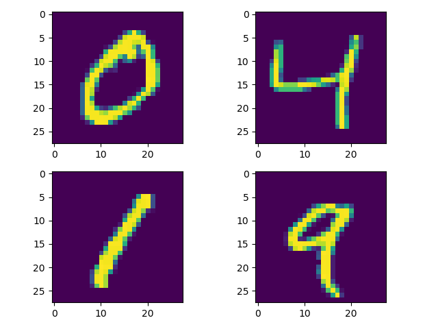

## Spatial Transformer Networks

[论文笔记：Spatial Transformer Networks](https://bywmm.github.io/2019/09/26/%E8%AE%BA%E6%96%87%E7%AC%94%E8%AE%B0%EF%BC%9ASpatial%20Transformer%20Networks/)

stn实现来自[kevin](https://github.com/kevinzakka/spatial-transformer-network)

添加在mnist数据集的实验。

## 实验结果

mnist数据集已经将手写数字很好的进行提取了。

原图如下。

当我们使用stn模块对图像进行处理时，4个epoch的结果。

epoch 1:

epoch 2:

epoch 3:

epoch 4:

可以更好的提取到目标。